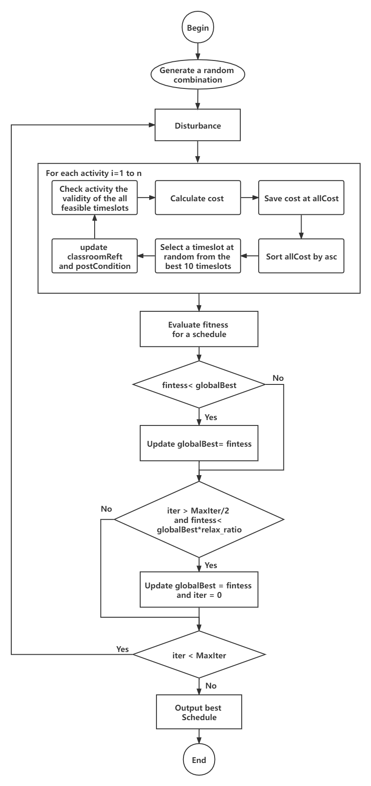

<div id="top"></div>
<!--
*** Thanks for checking out the Best-README-Template. If you have a suggestion
*** that would make this better, please fork the repo and create a pull request
*** or simply open an issue with the tag "enhancement".
*** Don't forget to give the project a star!
*** Thanks again! Now go create something AMAZING! :D
-->


<!-- PROJECT SHIELDS -->
<!--
*** I'm using markdown "reference style" links for readability.
*** Reference links are enclosed in brackets [ ] instead of parentheses ( ).
*** See the bottom of this document for the declaration of the reference variables
*** for contributors-url, forks-url, etc. This is an optional, concise syntax you may use.
*** https://www.markdownguide.org/basic-syntax/#reference-style-links
-->
<!-- [![Contributors][contributors-shield]][contributors-url]
[![Forks][forks-shield]][forks-url]
[![Stargazers][stars-shield]][stars-url]
[![Issues][issues-shield]][issues-url]
[![MIT License][license-shield]][license-url]
[![LinkedIn][linkedin-shield]][linkedin-url] -->


<!-- PROJECT LOGO -->
<br />
<div align="center">

  </img>
  <h3 align="center">A local search method for solving a bi-level timetabling and battery optimization problem</h3>
</div>


<!-- TABLE OF CONTENTS -->
<details>
  <summary>Table of Contents</summary>
  <ol>
    <li>
      <a href="#about-the-project">About The Project</a>
      <ul>
        <li><a href="#built-with">Built With</a></li>
      </ul>
    </li>
    <li>
      <a href="#getting-started">Getting Started</a>
      <ul>
        <li><a href="#prerequisites">Prerequisites</a></li>
        <li><a href="#installation">Installation</a></li>
      </ul>
    </li>
    <li><a href="#usage">Usage</a></li>
    <li><a href="#roadmap">Roadmap</a></li>
    <li><a href="#contributing">Contributing</a></li>
    <li><a href="#license">License</a></li>
    <li><a href="#contact">Contact</a></li>
    <li><a href="#acknowledgments">Acknowledgments</a></li>
  </ol>
</details>


<!-- ABOUT THE PROJECT -->
## Ranked 6th Place in the competition

Our team won the fifth place [in the competition](https://ieee-dataport.org/competitions/ieee-cis-technical-challenge-predictoptimize-renewable-energy-scheduling), and the overall ranking is sixth. The uploaded code only has the `optimized part`, and the predicted result has been directly given in the file (buildingTotalFinal.csv and solarTotalFinal.csv), which can be used directly.

## Environments
  ```sh
  JDK 1.8
  apache-maven-3.8.2
  ```
## File Directory Description
  ```
  IEEE-Predict-Optimize-Challenge
├── data
│   ├── buildingTotalFinal.csv ——Building load prediction data
│   ├── electricity_price
│   │   ├── PRICE_AND_DEMAND_202009_VIC1.csv
│   │   ├── PRICE_AND_DEMAND_202010_VIC1.csv
│   │   ├── PRICE_AND_DEMAND_202011_VIC1.csv
│   │   └── PRICE_AND_DEMAND_202012_VIC1.csv
│   ├── phase_2_data.tsf
│   ├── phase_2_instances
│   │   ├── phase2_instance_large_0.txt
│   │   ├── phase2_instance_large_1.txt
│   │   ├── phase2_instance_large_2.txt
│   │   ├── phase2_instance_large_3.txt
│   │   ├── phase2_instance_large_4.txt
│   │   ├── phase2_instance_small_0.txt
│   │   ├── phase2_instance_small_1.txt
│   │   ├── phase2_instance_small_2.txt
│   │   ├── phase2_instance_small_3.txt
│   │   └── phase2_instance_small_4.txt
│   ├── phase_3_data.tsf
│   ├── results
│   ├── solarTotalFinal.csv ——Solar power generation forecast data
│   └── submission ——Final submission results
├── images
├── README.md
└── src
    └── edu
        └── monash
            ├── io
            │   ├── FileUtils.java
            │   └── tsf
            └── ppoi
                ├── checker
                ├── constant
                ├── entity
                ├── Evaluation.java
                ├── ExpandTimeTable.java
                ├── instance
                ├── Phase.java
                ├── RABMain.java  ——Algorithm entrance
                ├── solution
                └── utils
  ```
## Getting Started
`RABMain.java` is the entry to the algorithm. To run RABMain, you need to configure 4 parameters in Program Arguments.
```sh
large_4 10 10 xyj
Instance_of_you_running maxRun MaxBatteryIter who
```
The result data of the large_4 run will be saved under the file `\data\results\instance14`.

<!-- CONTACT -->
## Ideas
We use the local search method to solve the optimization problem. At the beginning, we randomly generated an initial solution, the charging and discharging of the fixed battery remained unchanged, and the solution was searched through continuous local disturbance and mutation. When a better solution than the global one was generated, it was saved to the file. After that, the fixed schedule will not change, and the charging and discharging of the battery will also be optimized through continuous local disturbances and mutations. Good results will be saved in the file. The following flow chart shows the flow chart of the activity arrangement.
```sh
  Algorithm execution order
  1、Fixed battery charge and discharge
  2、Optimize schedule
  3、Fixed best schedule
  4、Optimize battery charge and discharge
```
<div align="center">
  </img> 
</div>


<!-- CONTACT -->
## Contact

Qingling Zhu - [zhuqingling@email.szu.edu.cn](zhuqingling@email.szu.edu.cn)

YaoJian Xu: [xuyaojian2021@email.szu.edu.cn](xuyaojian2021@email.szu.edu.cn)

<!-- ACKNOWLEDGMENTS -->
## Acknowledgments

Thanks to the competition organizers.At the same time, I am very grateful to the students and teachers in the laboratory for their help.

<!-- MARKDOWN LINKS & IMAGES -->
<!-- https://www.markdownguide.org/basic-syntax/#reference-style-links -->
[contributors-shield]: https://img.shields.io/github/contributors/othneildrew/Best-README-Template.svg?style=for-the-badge
[contributors-url]: https://github.com/othneildrew/Best-README-Template/graphs/contributors
[forks-shield]: https://img.shields.io/github/forks/othneildrew/Best-README-Template.svg?style=for-the-badge
[forks-url]: https://github.com/othneildrew/Best-README-Template/network/members
[stars-shield]: https://img.shields.io/github/stars/othneildrew/Best-README-Template.svg?style=for-the-badge
[stars-url]: https://github.com/othneildrew/Best-README-Template/stargazers
[issues-shield]: https://img.shields.io/github/issues/othneildrew/Best-README-Template.svg?style=for-the-badge
[issues-url]: https://github.com/othneildrew/Best-README-Template/issues
[license-shield]: https://img.shields.io/github/license/othneildrew/Best-README-Template.svg?style=for-the-badge
[license-url]: https://github.com/othneildrew/Best-README-Template/blob/master/LICENSE.txt
[linkedin-shield]: https://img.shields.io/badge/-LinkedIn-black.svg?style=for-the-badge&logo=linkedin&colorB=555
[linkedin-url]: https://linkedin.com/in/othneildrew
[product-screenshot]: images/screenshot.png
